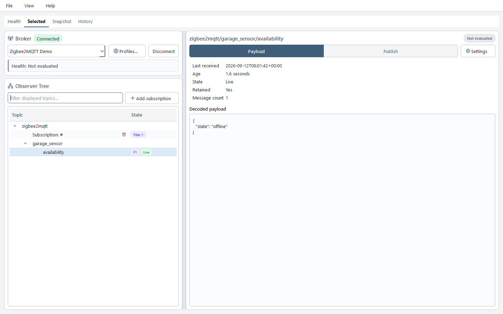
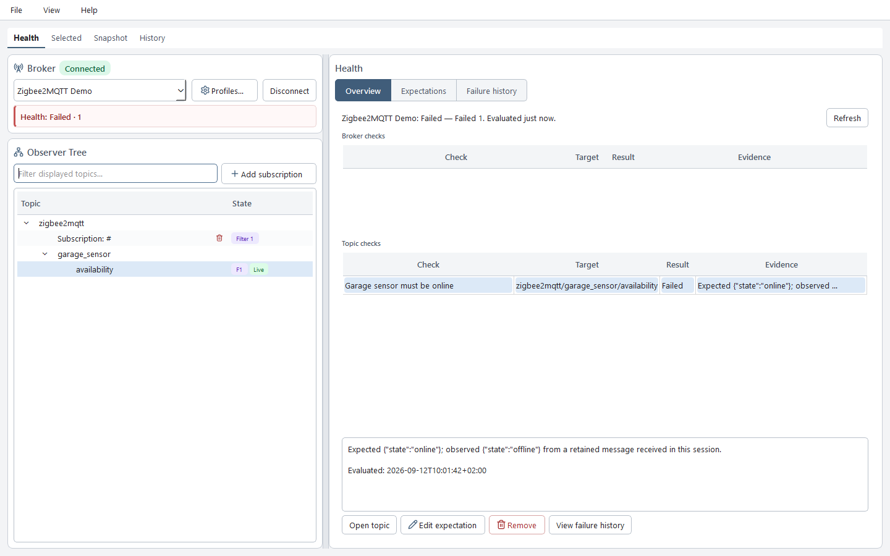
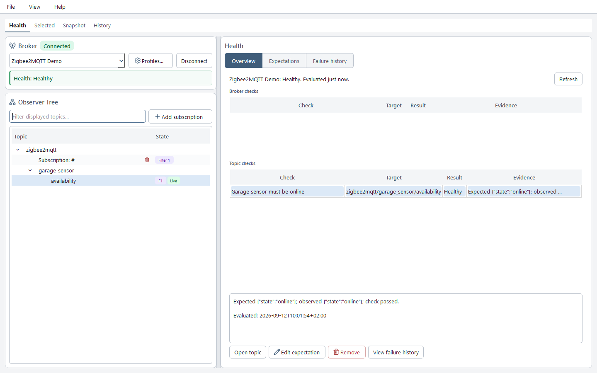

# Diagnose an offline Zigbee2MQTT device

This walkthrough matches TopicGate **1.5.3** and follows one device from an
observed value through an expectation failure, explanation, and recovery. It uses
the hardware-free [Zigbee2MQTT scenario](https://github.com/Dumdart/TopicGate/blob/master/demo/zigbee2mqtt_scenario/README.md).

The screenshots use the scenario's deterministic payloads in the current Desktop
UI. They were rendered without a network connection or credential store, so they
demonstrate the user journey and observation semantics rather than certifying a
live broker integration. The visible Desktop components are unchanged from the
`v1.5.3` tag.

## 1. Observe the device state

TopicGate receives the retained availability message for
`zigbee2mqtt/garage_sensor/availability`. **Live** means the value arrived in this
observation session; it does not mean the decoded device state is healthy. The
payload itself reports `{"state":"offline"}`.



## 2. Evaluate the expectation

The enabled critical expectation **Garage sensor must be online** requires the
exact UTF-8 payload `{"state":"online"}`. Refreshing Health evaluates the latest
local evidence. The observed offline payload does not match, so the check fails.



## 3. Explain the failure

Selecting the check keeps the rule, target, result, and evidence together:

> Expected `{"state":"online"}`; observed `{"state":"offline"}` from a retained
> message received in this session.

This is stronger than treating the green **Live** badge or broker connection as a
health result. The broker is connected and the message is recent, but the device's
own availability payload says it is offline. Because the expectation stores
failure history, TopicGate also retains the episode after recovery.

## 4. Observe recovery

The scenario publishes `{"state":"online"}` to the same topic. A new Health
evaluation passes the same unchanged rule and closes the earlier failure episode.



The result proves only what TopicGate observed: the latest payload matches the
configured expectation. It does not prove that every device function is healthy.

## Read-only agent example

The default MCP mode can explain this already-observed state without connecting,
refreshing observations, changing expectations, or publishing. Ask:

> Inspect the saved broker named Zigbee2MQTT Demo in read-only mode. For
> `zigbee2mqtt/garage_sensor/availability`, compare the latest TopicGate-observed
> value with its configured expectation and summarize any recovered failure
> episode. Do not connect, refresh, evaluate health, publish, or change settings.

The agent can use only passive tools:

```text
inspect_broker(broker="Zigbee2MQTT Demo", include_snapshot=true)
list_health_expectations(broker="Zigbee2MQTT Demo")
query_failure_history(
    broker="Zigbee2MQTT Demo",
    topic="zigbee2mqtt/garage_sensor/availability",
    status="recovered",
)
```

A grounded answer after the recovery is:

> TopicGate's latest observed payload is `{"state":"online"}`. The enabled rule
> expects the same value. Failure history records an earlier `MISMATCH` for the
> offline payload and marks that episode recovered. This is passive stored/current
> evidence; I did not connect, refresh observations, run a new health evaluation,
> publish, or change configuration.

Read-only mode can list expectation definitions and query existing failure history,
but it cannot freshly evaluate expectations. `get_health_report` is control-only
because evaluation may persist transitions and failure episodes.

