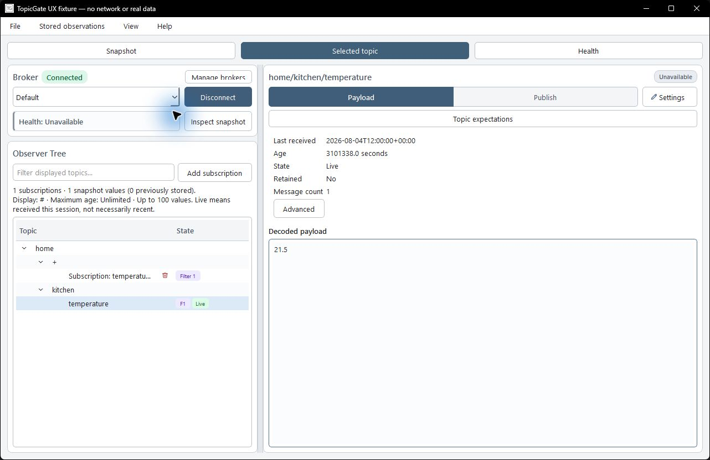
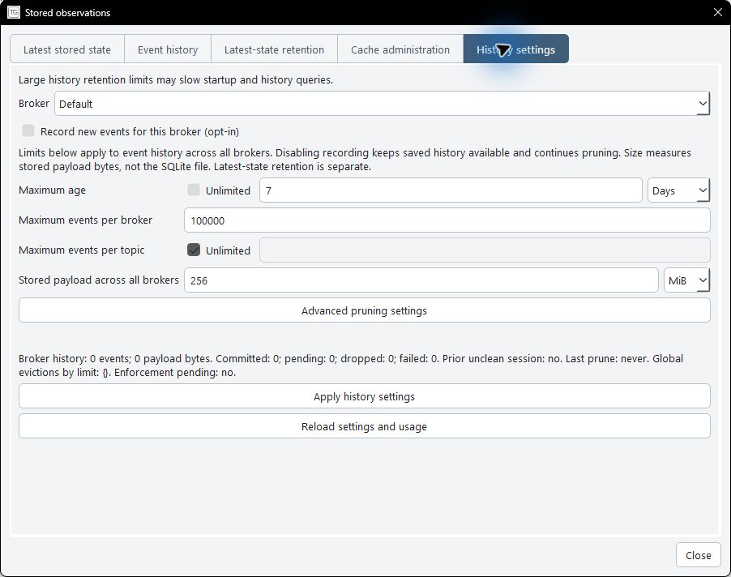

# Desktop workspace

The workspace separates MQTT subscriptions, snapshot values, saved receipts, and
health failures. These views describe different scopes; their counts need not match.

## Observe and navigate

- **Add subscription** changes which MQTT topics TopicGate listens for.
- **Filter displayed topics** narrows the tree locally. It does not subscribe,
  publish, reconnect, or change snapshot counts. A visible notice identifies an
  active text filter, including when nothing matches it.
- The tree summary shows subscription and snapshot-value counts, the number of
  previously stored values, and the active topic filter, age bound, and result cap.
  Subscription rows remain visible when no snapshot values match.
- **Live** means received during the current session, not necessarily recently.
  Check the selected topic's receive time and age. A value opened directly can be
  outside the bounded snapshot; its scope notice explains why it is not counted.
- Use the compact **Health**, **Selected**, **Snapshot**, and **History** tabs
  to navigate. Health opens by default; saved topic selection remains available under
  Selected. An underline marks the selected destination. **Profiles...**, beside
  the broker selector, opens the existing profile menu. The connection action and
  connection status stay in the Broker group; its health summary is a separate shortcut.

## Expectations

**Health → Expectations** lists configured rules for the selected broker. Choose
**All expectations**, **Broker expectations**, or **Topic expectations** to narrow
the directory. Select a rule and choose **Edit selected expectation**, or double-click
it. Topic rules open with their exact topic and rule selected. **Health** returns to
the previous health tab. **Expectations** sits beside the payload/publish tabs for a
concrete topic. **Close settings** closes the side panel.

The narrow topic editor shows rule names and results; selecting a rule reveals its
condition and configuration in the form. Save confirms the change in the editor.
Broker forms and settings pages scroll when necessary at smaller window sizes.

## Message history, latest values, and health failures

| Destination | What it contains |
| --- | --- |
| Stored observations → Latest stored values | Most recently persisted value for each broker/topic |
| History → Message history | Individual receipts saved while recording was enabled |
| Health → Failure history | Diagnostic failure episodes, not MQTT receipts |

**History** is always available in the workspace, including while disconnected.
Opening it selects the workspace broker and loads recording status before Search.
The History broker selector can browse another broker without connecting to it.
Returning to History selects the workspace broker again; a broker change clears
results and pagination, while topic/time filters remain available.

**Record messages** enables or disables recording for the broker displayed immediately
above it. It uses the existing recording service without changing retention or
removing saved receipts. The checkbox is unavailable while applying a change, before
status loads, or after a failure. **Retry** appears when status needs reloading.
Help beside the checkbox explains that recording applies to future receipts and
cannot recover gaps. Query results do not repeat a potentially stale recording state.

**History settings** provides recording and retention controls. Age and payload size
use the same unit choices as latest-state retention. Optional age and per-topic count
limits use **Unlimited**; mandatory broker-count and global payload limits remain
bounded. Only pruning batch size and idle interval are under **Advanced pruning
settings**. Apply confirms success on the page.

**Search** starts a fresh message query; **Next page** continues its
fixed boundary. Latest-state sorting and limits remain independent. Red cache
actions identify their scope; **Delete cache for all brokers** affects latest stored
values, not broker profiles, event history, or failure history. Existing deletion
previews and confirmations remain in effect.

## Layout

The duplicate broker Snapshot button and History Refresh action were removed. Topic
Expectations shares the payload/publish control row instead of occupying a separate
full-width row. No new Advanced toggles or global mode were added.

## Earlier implementation evidence

Publishing keeps encoding next to a multiline payload editor that uses the available
space. Tab moves from the editor to the next control. Publish remains disabled until
its existing connection, topic, payload, and busy-state requirements are met.
Subscription Apply sits beside its form and confirms completion.

**The screenshots and validation results below belong to the earlier implementation.**
They are preserved as supplied artifacts and do not validate the current changes.
No replacement screenshots were generated; current visual and interaction validation
will be performed by the user.

These screenshots use an in-memory fixture with no network or real profile storage.
Baseline images were captured before editing. Health is unavailable in the fixture;
that status is not evidence about a real broker. Window checks covered 1280×800,
1024×640, and a maximized Windows desktop.

| Audit finding | Before | After |
| --- | --- | --- |
| Ambiguous observer state and hidden navigation | [Observer baseline](images/ux-review/before-observer.jpg) | [Observer](images/ux-review/after-observer.jpg) |
| Subscription row with zero matching values | Audit: row and empty-state descriptions conflicted | [Filtered snapshot and selected value](images/ux-review/after-filtered-empty.jpg) |
| Disconnected publish layout | [Publish baseline](images/ux-review/before-publish.jpg) | [Publish editor](images/ux-review/after-publish.jpg) |
| Recording discovery | Audit: status appeared only after Search | [Event history](images/ux-review/after-event-history.jpg) |
| Inconsistent units and technical settings | Audit: raw seconds/bytes and blank limits | [History settings](images/ux-review/after-history-settings.jpg) |
| Separate expectation scopes | Audit: topic checks absent from broker-only tab | [Expectation directory](images/ux-review/after-expectations.jpg) |
| Window-size behavior | Audit had not tested small windows | [Small workspace](images/ux-review/after-small-window.jpg), [maximized](images/ux-review/after-maximized.jpg) |





No MQTT semantics, persistence policies, credentials, CLI, or MCP contracts change.
Reconstructing missing receipts, changing snapshot inclusion rules, and altering
retention behavior remain outside this GUI work.

Validation used the nearby GUI/view-model tests and the full repository suite.
Computer Use verified navigation, the recording enable action on an in-memory
profile, advanced disclosure, disabled controls, and clearing snapshot filters.
Its Qt text-entry API reported stale focus and a UIA cache error; keyboard focus
preservation and no-match text filtering were checked in Qt regression tests.
Real broker publishing, reconnects, recording changes, and data deletion were
not used as UX tests. Windows was checked; other desktop platforms were not.

Validation commands and results:

```powershell
uv run pytest tests/test_gui.py tests/test_event_history_gui.py tests/test_desktop_snapshot_states.py tests/test_main_view_model.py tests/test_snapshot_presentation.py -q
# 143 passed
uv run pytest tests/test_gui.py::test_subscription_apply_feedback_and_small_window_layout -q
# 1 passed after the focus-preservation change
uv run pytest tests/test_event_history_gui.py -q
# 6 passed after the broker-scope guard
uv run pytest
# Final code: 695 passed, 1 skipped, 2 warnings in 98.52 seconds
git diff --check
# Passed; Git reports local LF-to-CRLF conversion warnings
```

The full-suite warnings concern SQLite's deprecated default datetime adapter in
migration tests. The skipped test is in `tests/test_health_wait_wire.py`.


## Current pass: manual validation

Automated tests verify state, signals, scoping, and layout constraints; they do not
establish visual usability. Validate the current interface at 1024×640 and a larger
window, including keyboard navigation:

- Open History without visiting storage settings. Confirm the broker, recording
  status, and Record messages checkbox are immediately understandable.
- In an isolated test profile, enable and disable recording. Confirm pending/error
  feedback and that browsing another broker does not change the connection.
- Search history, inspect a payload, and use Next page. Change broker or filters and
  confirm old results clear. Return from Snapshot and check the workspace broker.
- Switch tabs and follow health/expectation shortcuts. Confirm the selected tab,
  topic context, and unfinished settings edits remain understandable and intact.
- Open Profiles beside the selector; check management access, connection action,
  and separate health status. Check that fields and actions fit at the smaller size.
- Distinguish History receipts, Stored observations → Latest stored values, and
  Health → Failure history. Check storage settings remain readable.

All ten supplied `docs/images/ux-review` artifacts were verified unchanged by
SHA-256. This pass did not create screenshots or operate real brokers.


## Current pass: automated checks

```powershell
uv run pytest tests/test_gui.py tests/test_event_history_gui.py tests/test_desktop_snapshot_states.py tests/test_main_view_model.py -q
# 140 passed in 46.27 seconds
uv run pytest tests/test_event_history_gui.py -q
# 8 passed in 2.28 seconds after the recording reload guard
uv run pytest
# 697 passed, 1 skipped, 2 warnings in 112.34 seconds
git diff --check
# Passed
```

The two warnings are SQLite datetime-adapter deprecations in migration tests;
`tests/test_health_wait_wire.py` is skipped. Regression coverage includes History
navigation without mutation, broker-scoped recording enable/disable, unchanged
retention, repeat-click protection, stale status responses, loading-state guards,
pagination reset, and existing topic/settings navigation.


Navigation-order follow-up: **Health (default) | Selected | Snapshot | History**.
Startup keeps any saved topic available under Selected while opening Health.

```powershell
uv run pytest tests/test_gui.py tests/test_event_history_gui.py -q
# 90 passed in 49.61 seconds
uv run pytest
# 697 passed, 1 skipped, 2 SQLite deprecation warnings in 104.17 seconds
git diff --check
# Passed
```

Manual check: restart with a saved topic, confirm Health is selected, then open
Selected and confirm that topic is still available.
