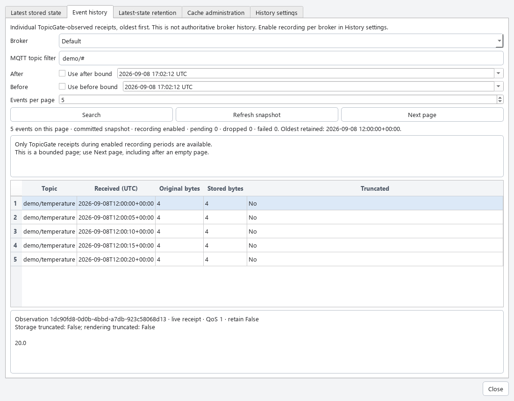
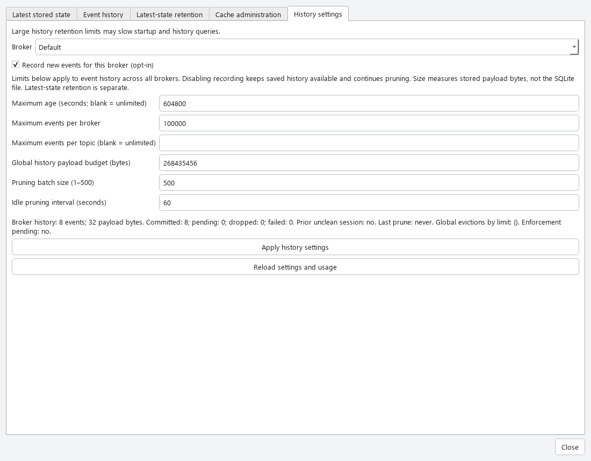

# Observation history

TopicGate event history contains individual MQTT receipts observed by TopicGate.
It is not authoritative broker history. The `mqtt_message` table remains the
latest stored value per broker/topic; diagnostic failure episodes are separate.

The history migration starts with an empty event store. It does not manufacture
events from latest-state rows. Broker deletion cascades to that broker's events;
downgrading past the history migration discards event history while preserving
latest-state rows. Observation UUIDs identify immutable events, and a separate
persistent insertion sequence supports stable snapshots without timestamp guesses.

Recording is disabled by default and enabled independently for each broker.
Disabling stops admission and drains already admitted events without deleting them.
Only receipts during enabled observation periods can appear in history; reconnects
and retained MQTT messages are new receipts, not reconstructions of past activity.

History uses a FIFO queue bounded by 1,000 pending events and 16 MiB of pending
payloads, including writes in flight. Batches contain at most 100 events. When
full, new history copies are dropped while current state and health evaluation
continue. Failed batches roll back and later writes may proceed; recording
counters expose admissions, commits, pending writes, drops, and failures.

Sessions checkpoint counters to persistence. A previous unclosed session means
potentially incomplete history, not an exact count of events lost in a crash.
Shutdown gives history ten seconds to drain and reports failures or timeout.
Exactly-once delivery across crashes is not guaranteed. Pending history is drained
before broker deletion; a drain timeout aborts deletion.

## Opt-in and independent retention

Open **History**, select a broker, and choose
**Record messages**. Its status is shown before Search. This action
enables or disables recording for future receipts without changing retention limits.
To adjust limits, open **Stored observations → History settings**, select the broker,
edit the controls, and choose **Apply history settings**. The shared history
limits start at seven days, 100,000 events per broker, no per-topic cap, and
256 MiB of stored payloads globally. Use **Unlimited** for age or per-topic caps.
Age and payload limits have unit selectors; batch size and the idle interval are
under **Advanced pruning settings**. Saved changes show confirmation on the page.
Large history retention limits may slow startup and history queries.

**Search** starts a fresh query including newly saved events.
**Next page** continues the current query's fixed boundary. Event history is oldest
first; latest stored state has independent sorting and result limits. These views
do not replace **Health → Failure history**. See the [desktop guide](DESKTOP_UX.md)
for screenshots.

The size budget counts stored payload bytes, not database file bytes, indexes,
or filesystem allocation. Zero-byte events still count toward event limits.
Policy changes validate before persistence. Pruning applies age, per-topic count,
per-broker count, then the global byte budget, always oldest first with UUIDs
breaking timestamp ties. Each eviction is attributed to its first applicable limit.

Pruning removes at most 500 events per transaction (adjustable downward), releases
locks between batches, and resumes at most once per second when more work may
remain. Idle checks default to 60 seconds and are adjustable. Enforcement is
eventual: usage may temporarily exceed limits between batches. Settings report
broker usage and global eviction totals, last prune, and pending enforcement.
Turning recording off does not stop retention enforcement or erase saved events.

## Read-only MCP history

`get_topic_history(broker, topic_filter, after=None, before=None, cursor=None,
limit=100)` accepts a broker UUID or unique name and MQTT wildcards. `#` and `+`
do not match leading `$` system topics unless the filter explicitly starts with
`$`. Time bounds must include a timezone, are normalized to UTC, and are exclusive.

Results are oldest first by `(received_at, observation_id)`. The first page freezes
the committed insertion boundary; later arrivals, even with older or equal receipt
times, appear only after a fresh query without a cursor. Cursors are versioned,
opaque continuation tokens scoped to broker/filter/time bounds. Do not edit them.
Retention may delete snapshot events between pages; limitations flag that change.

Pages contain at most 500 records (default 100), with at most 16 KiB of each stored
payload rendered and 256 KiB of JSON-encoded payload fields across the page.
Responses include original/stored/rendered sizes and both truncation flags.
Binary payloads use base64 and have no UTF-8 text field. A bounded scan may return
an empty page with `next_cursor`; continue until the cursor is null. Pending
writes are excluded, and queries never flush, connect, enable recording, or prune.

Always inspect `recording`, `retention`, `usage`, and `limitations`. Retention's
oldest available receive time is a storage horizon, not proof of uninterrupted
coverage. Settings summaries and eviction generations apply globally where labeled.

## Desktop pages

**Stored observations → Latest stored values** shows one persisted value per topic.
The workspace **History** tab shows individual receipts using the same bounded query
as MCP. **Record messages** enables or disables recording for its displayed broker
without changing retention. Search starts over; Next page continues the committed snapshot.
Changing brokers or filters resets the cursor. Payloads are displayed as plain
text or base64, with provenance and truncation details on selection.

These screenshots show the earlier dialog layout; message history now lives in the workspace.

