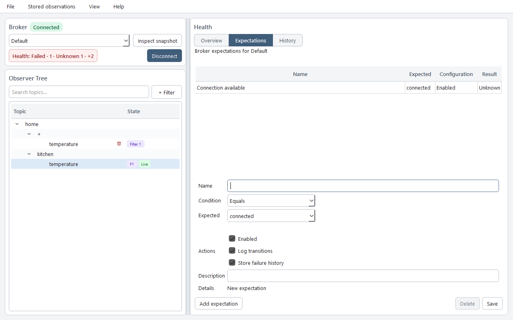
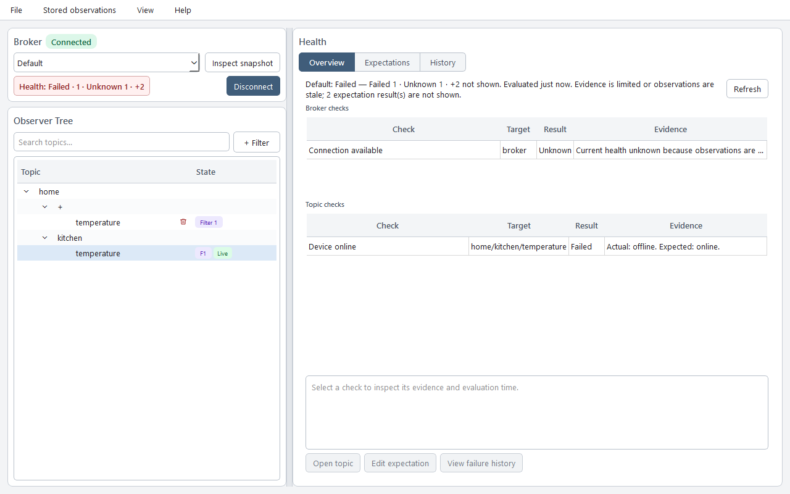

# Control mode and expectation verification

## Explicitly enable control mode

Read-only mode is the normal setup. Control mode adds broker creation/activation, connection changes, subscription and expectation changes, fresh health evaluation, live observation, and publishing. Enable it only for a trusted agent environment. Publishing can affect real devices: confirm the broker, topic, payload, encoding, QoS, and retain setting first.

Installing TopicGate or its plugin does not enable control mode. The plugin selects a read-only configuration; the bundled `.mcp-control.json` is an example, not an automatically loaded override.

Follow your host's guide: [Codex](CODEX.md), [Claude Code](CLAUDE_CODE.md), [Cursor](CURSOR.md), or [VS Code / Copilot](VSCODE_COPILOT.md). For the supported CLI integrations, explicitly choose the host, for example:

```console
topicgate-cli integration install codex --mode control
```

Replace `codex` with `claude`, `cursor`, or `copilot` as appropriate. Cursor still needs interactive plugin installation for skills. The helpers manage known entries, not every host scope; Claude's namespaced plugin server may remain enabled alongside a manual entry. Inspect the host's enabled servers rather than assuming there is only one.

For MCP-only setup, configure the existing entry to launch `topicgate --mode control`. In JSON this means `"args": ["--mode", "control"]`; preserve any executable-prefix arguments and data-directory environment from Desktop. VS Code uses `servers`, while Cursor uses `mcpServers`. Do not edit cached plugin manifests or start competing control processes against the same database.

Restart the MCP server/host and start a new task or session after changing mode or upgrading. Verify that `activate_broker`, `create_broker`, and `wait_for_broker_health` are exposed. `list_health_expectations` alone does not imply control mode. Missing tools may indicate read-only configuration, an older executable, or a stale process. See [upgrade and recovery](UPGRADE_AND_RECOVERY.md).

To return to read-only with a helper-managed integration, run the install command with `--mode read-only` and restart the host. For MCP-only setup, change the existing entry back to read-only and restart. Desktop's configuration-mode selector only generates a preview; it does not change a running MCP server's permissions.

## Credentials and broker selection

Anonymous broker creation is supported. A username without stored credentials saves a profile with `status: needs_credentials`; configure that UUID in Desktop before continuing. No raw password or credential_ref is accepted. Existing credentials are keyed by profile UUID. Broker switching disconnects the current connection and leaves the selected broker active after the workflow. Publishing is a separate explicit action.

## Complete example

This example verifies the connection itself, not a publisher. Use additional topic/freshness conditions when those are part of the requested definition of health. The protocol regression runs these five calls against fake MQTT with isolated real storage:

```json
{"tool":"create_broker","arguments":{"request":{"name":"Lab","host":"localhost","port":1883,"username":"","use_tls":false}}}
{"tool":"activate_broker","arguments":{"broker_id":"<returned broker UUID>"}}
{"tool":"add_subscription","arguments":{"broker_id":"<returned broker UUID>","topic_filter":"devices/#"}}
{"tool":"create_health_expectation","arguments":{"broker":"<returned broker UUID>","request":{"name":"Connected","description":"The broker connection is established","target":{"kind":"broker"},"condition":{"kind":"equal","expected":{"encoding":"text","value":"connected"}}}}}
{"tool":"wait_for_broker_health","arguments":{"broker":"<returned broker UUID>"}}
```

The tested final result has `outcome: satisfied`, `scope: whole_broker`, `domain_status: healthy`, complete evidence, one enabled/evaluated expectation, one evaluation, no connection side effects, and `selected_broker_left_active: true`. Actual responses also include UUIDs, UTC timestamps, elapsed seconds, required revisions, bounded findings and omitted counts. This is an isolated test result, not evidence about your broker.

For an explicitly requested topic value, use target `{"kind":"topic","topic":"devices/status"}` and condition `{"kind":"equal","expected":{"encoding":"utf8","value":"online"}}` after a covering subscription exists. Do not publish to make it pass. Missing traffic times out with unknown/incomplete evidence; retained delivery does not establish publisher liveness. Use an explicitly requested freshness age when needed.

See the [plugin contract](../../topicgate-plugin/CONTRACT.md) for transaction semantics, retry/partial persistence, wait limits and synchronous storage cancellation limitations.

## Define checks in Desktop

Open **Health → Expectations** to configure a broker connection check. For a concrete topic, select it in the observer tree and use **Topic expectations**. Add a covering subscription before creating a topic expectation. The overview shows the evaluation result and evidence; history records failure episodes when the storage action is enabled.



*Sample configuration in Desktop; these screenshots are UI examples, not a live assessment of your broker.*

## Interpret a health wait

The default wait is 30 seconds, with a maximum of 60 seconds. It uses the existing active connection and leaves that broker active. Set `stable_for_seconds` when the requested checks must stay healthy for an interval, rather than pass at a single evaluation.

| Outcome | Meaning and next step |
| --- | --- |
| `satisfied` | The requested expectations passed with complete evidence. Check `scope`: a selected subset can pass while other broker checks fail. |
| `timed_out` | The criteria did not pass within the window. Inspect the timestamp and final report for failed, unknown, or missing evidence before deciding whether to wait again. |
| `disconnected` | The connection is unavailable. Diagnose it and explicitly reconnect before retrying. |
| `configuration_changed` | The broker, subscriptions, or expectations changed during verification. Inspect the current configuration before starting another wait. |

An empty or all-disabled expectation set cannot satisfy verification. Invalid bounds, missing IDs, lease conflicts, and storage errors are tool errors rather than health outcomes. Check the whole-broker report, evidence completeness, and omitted findings even when verifying a subset. A final report may be unavailable if no evaluation completed before the deadline.



*Connection state and expectation health are separate. Limited observations can leave a check unknown even while the connection is established.*

## Observation history and support

Individual MQTT receipt history is separate from health failure episodes and latest-state snapshots. Open **History** and enable **Record messages** for the displayed broker; recording starts disabled. Use read-only `get_topic_history` to inspect saved receipts. In Advanced mode, **Stored observations → History settings** controls retention limits. See [history setup and completeness](../OBSERVATION_HISTORY.md).

For troubleshooting, see [support bundles and safe sharing](SUPPORT_BUNDLES.md). Broker credentials remain local and passwords are never passed through MCP.
